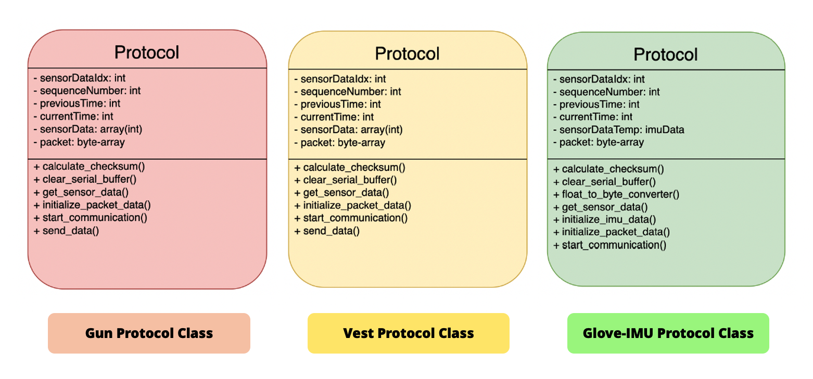

# NUS Computer Engineering Capstone Project: Augmented Reality AI Accelerated Laser Tag Game

## Project Overview and System Functionalities

### Overview
This project develops an innovative augmented reality laser tag system designed for multiplayer combat scenarios. The system enables dynamic gameplay between two or more players within a designated arena, maintaining optimal engagement distances of 7-10 meters between participants.
Each player's equipment consists of three integrated wearable components: a tactical gun, a sensor-equipped vest, and a smart glove. The gun incorporates infrared transmitters to create realistic laser-based combat interactions, while the vest features strategic sensor placement to accurately detect incoming shots. The smart glove employs advanced gesture recognition sensors, allowing players to execute various in-game commands and actions through natural hand movements during combat.
These interconnected components work together to create an immersive augmented reality combat experience that blends physical movement with digital gameplay elements.

### Player Actions
Players should be able to carry out the following actions during the game:
Shoot: Target and inflict damage on opponent in line of sight with laser gun.
Reload: Replenish ammo when depleted.
Shield: Gesture-activated protection.
Grenade: Gesture-based throwing action to damage opponent in line of sight.
Logout: Gesture to end game and logout.

### User Stories
| As a | I want to | so that |
|----------------|-----------|----------|
| Player | log into the laser tag game | I can play the laser tag game |
| Player | shoot my opponent in my line of sight within 7-10m | I can damage my opponent |
| Player | play for 60 mins without disconnection | I can have smooth gameplay |
| Player | see game statistics (health, ammo, shield) | I can plan an efficient gameplay stratergy |
| Player | know when I hit my opponent | I can confirm my aim |
| Player | throw a grenade in my line of sight | I can inflict grenade damage |
| Player | activate my shield | I can protect myself from potential attacks|

---

## System Architecture 
The system implements a sophisticated laser tag game utilizing an Ultra96 board as its central processing unit. Multiple hardware components connect to this board to enable gameplay features including motion detection, shot registration, and real-time state management.

### Core Hardware Components

#### Illustration of Overall Architecture

*Figure: Complete system architecture showing interconnections between hardware components and the Ultra96 board*

#### Wearable Components
##### Sensor Placement in Wearable Components
The system features three primary wearable components that players use during gameplay. The following Diagram showcases the placement of the hardware sensors on the respective components.

*Figure: The above figure showcases the placement of the sensors we utilized on the players wearables*

1. **Gun Assembly**
   - Equipped with IR transmitters.
   - Integrated bullet count display.
   - Provides real-time ammunition feedback.

*Figure: Detailed gun assembly showing IR transmitter placement and display integration*

2. **Tactical Vest**
   - Features IR receivers for shot detection.
   - Includes HP display for health monitoring.
   - Strategic sensor placement for optimal detection.

*Figure: Vest design showing IR receiver placement and display mounting points*

3. **Smart Glove**
   - Integrated motion sensors.
   - Enables gesture detection.
   - Provides real-time movement data.

*Figure: Action glove design showing MPU and bluno beetle microcontroller placement*

### Ultra96 Process Architecture

The system implements a sophisticated multi-process architecture on the Ultra96 board, utilizing multiprocessing queues and arrays for robust inter-process communication.

#### Process 1: Relay Node
This primary process manages all hardware component communications through several child processes:

1. **Update Beetles (Child Process 1)**
   - Manages socket connections for player equipment.
   - Handles real-time updates of bullet counts and HP.
   - Ensures synchronization between components.

2. **Component Handlers (Child Processes 2-7)**
   Each handler process manages a specific component type:
   - **Gun Handler**: 
     - Processes shooting actions.
     - Updates ammunition counts.
     - Manages trigger events.
   
   - **Vest Handler**:
     - Detects and processes hit registration.
     - Updates player health status.
     - Manages damage calculations.
   
   - **Glove Handler**:
     - Processes motion data at 20Hz.
     - Forwards data to HW Accelerator.
     - Manages gesture recognition pipeline.

3. **Hardware Accelerator (Child Processes 8-9)**
   - Dedicated process per player.
   - Handles gesture recognition acceleration.
   - Manages hardware-level motion processing.

#### Process 2: Game Engine
The central game logic coordinator responsible for:
- Maintaining current game state.
- Processing player actions from action_queue.
- Updating game signals based on events.
- Communicating with evaluation server.
- Managing hardware component state updates.

#### Process 3: Eval Client
Handles all evaluation server communications:
- Implements AES encryption for data security.
- Manages game state verification.
- Processes server responses.
- Updates game engine with verified states.

#### Process 4: MQTT Client
Manages real-time communication through:
- HiveMQ broker connection management.
- Subscription to "LaserTag/OppInFrame" topic.
- Game state publishing to "LaserTag/GameState".
- Real-time visualizer updates.

#### Process 5: Console Interface
Provides system monitoring through:
- Real-time component status display.
- Action history tracking.
- Game state visualization.
- System log management.

### Inter-Process Communication
The system utilizes multiple communication mechanisms:
- Multiprocessing queues for asynchronous data transfer.
- Shared arrays for real-time state management.
- Socket connections for external communications.
- MQTT for visualization updates.

*Figure: Inter-process communication showcased in the console interface*

This architecture ensures robust gameplay management while maintaining clear separation of concerns between different system components.

---

## Embedded Hardware and Sensor Network Design and Implementaion
### List of Technical Components
Here are the main components used in the system:

| Component | Use |
|-----------|-----|
| DFR0339 Bluno Beetle | Receives sensor data and transmits to relays |
| MPU6050 (GY-521) | source of Linear and Gyroscopic data for gestures associated with Shield, Grenade, Reload, and Logout Move; Placed on player's action glove |
| IR Transmitter and Receiver | Transmitter on gun for laser shots simulation; Receiver on vests for shot detection |
| Piezo Buzzer | Provides audio feedback for both gun and vest |
| TM1637 4 Digit 7-Segment | Display on vest showing opponent's health |
| Trigger Button | On gun to enable IR signal emission for shots |
| Apparels | Vest, Glove, and Gun |

### Pin Configurations

#### Bluno Beetle to MPU Connection
| Pin on DFR0339 Bluno Beetle | Pin on MPU-6050 |
|-----------------------------|--------------------|
| 5V | VCC |
| GND | GND |
| A5 | SCL |
| A4 | SDA |

#### Bluno Beetle, IR Transmitter, Switch, Piezo Buzzer Connection
| Pin on DFR0339 Bluno Beetle | Pin on IR Transmitter | Pin on Switch | Pin on Piezo Buzzer |
|-----------------------------|----------------------|---------------|-------------------|
| 5V | VCC | - | - |
| GND | GND | GND | GND |
| D2 | - | VCC | - |
| D3 (PWM) | OUT | - | - |
| D5 (PWM) | - | - | VCC |

#### Bluno Beetle, IR Receiver, TM1637, Piezo Buzzer Connection
| Pin on DFR0339 Bluno Beetle | Pin on IR Receiver | Pin on TM1637 | Pin on Piezo Buzzer |
|-----------------------------|-------------------|---------------|-------------------|
| 5V | VCC | VCC | - |
| GND | GND | GND | GND |
| D2 | - | DIO | - |
| D3 (PWM) | OUT | - | - |
| D4 (PWM) | - | CLK | - |
| D5 (PWM) | - | - | OUT |

### Operating Voltages
| Component | Operating Voltage |
|-----------|------------------|
| DFR0339 Bluno Beetle | 5V |
| MPU-6050 | 2.375V - 3.46V |
| IR Transmitter | 1.2V |
| IR Receiver | 2.7V - 5.0V |
| Piezo Buzzer | 1.5V - 2.4V |
| TM1637 4 Digit 7 Segment Display | 3.3V - 5V |

### Libraries and Implementation
The system uses the following libraries in C++:
1. Glove: `<Wire.h>` and `<MPU6050.h>` for I2C communication.
2. Gun: `<IRremote.hpp>` for IR signal transmission.
3. Vest: `<IRremote.h>` and `<TM1637Display.h>` for IR reception and display.

### Circuit Schematics

*Figure: Circuit connections between Bluno Beetle microcontroller and MPU Sensor*

*Figure: Circuit connections between Bluno Beetle microcontroller, IR Transmitter Piezo Buzzer, and Push Button*

*Figure: Circuit connections between Bluno Beetle microcontroller, IR Receiver and LED Strip*

### Implementation Details

#### Glove Implementation
- Uses I2C communication through Wire.h.
- Extracts X, Y, Z axes data from MPU6050 for both accelerometer and gyroscope.
- Combines two registers per axis to get correct values.

#### Gun Implementation
- Emits unique IR signals per player using `IRSender.sendNEC(address,command,repeats)`.
- Piezo buzzer provides audio feedback for successful shots and empty ammo.

#### Vest Implementation
- Constantly receives and decodes IR signals using `IrReceiver.decode()`.
- Validates signals based on player-specific commands.
- Updates health display on TM1637.
- Provides audio feedback for successful hit registration.

#### Issues and Solutions
A key issue encountered during integration was the vest's inability to simultaneously receive data from both Serial (bluetooth) and IR Receiver. This was resolved by reinitializing the IR Receiver after bluetooth data reception using `IrReceiver.begin(IR_RCV_PIN)`.

---

## Hardware Accelerated Neural Motion Intelligence Engine Design and Implementation

The hardware AI component represents a sophisticated sub-system designed to process sensor data and recognize player actions in real-time. The system comprises several interconnected stages that work together to transform raw sensor data into meaningful gameplay actions.

### Synthesis and Simulation Setup

The implementation process utilizes Vivado HLS to transform C++ code into RTL code through these essential steps:

1. Building the neural network in C++.
2. Verifying the code through the C-simulation in Vivado HLS.
3. Executing C-synthesis.
4. Verifying the kernel through RTL simulation.
5. Reviewing synthesis and co-simulation reports.

*Figure: Final block design showing the neural network IP and peripheral IPs with AXI DMA connections*

### Data Collection and Processing

The system begins with data collection from an MPU6050 sensor mounted on the player's glove, sampling at 20Hz to capture six fundamental measurements: three-axis acceleration and three-axis gyroscopic data. The move detection algorithm processes this continuous data stream using a sliding window approach to identify meaningful actions:

- Window Size: 8 data points covering 0.4 seconds.
- Energy Calculation: Computes total movement energy within each window.
- Movement Detection: Identifies significant energy changes between consecutive windows.
- Action Capture: Records 30 subsequent data points (1.5 seconds) from the data stream when movement is detected.

*Figure: Energy formula*

### Feature Engineering

Once movements are detected, the system transforms raw sensor data into meaningful features through a sophisticated processing pipeline:

| Raw Sensor Features | Statistical Features (calculated for each raw feature) |
|--------------------|----------------------------------------------------|
| Acceleration x-axis | Mean |
| Acceleration y-axis | Standard deviation |
| Acceleration z-axis | Root mean square |
| Gyro x-axis | Kurtosis |
| Gyro y-axis | Skewness |
| Gyro z-axis | Interquartile range |
|                    | Median absolute deviation |
|                    | Frequency domain mean |
|                    | Frequency domain range |
|                    | Frequency domain skewness |

The system initially generates 60 features (6 measurements × 10 statistical features), which are then reduced to 16 features through PCA, maintaining 95% of the data variance while improving computational efficiency.

### Neural Network Architecture

The system employs a Multi-layer Perceptron (MLP) architecture, chosen for its optimal balance of performance and implementation complexity:

- Input layer: 16 nodes (receiving the processed features).
- Hidden layer: 32 nodes (determined through hyperparameter tuning).
- Output layer: 5 nodes (representing idle, shield, grenade, reload, and logout actions).
- Activation functions: Leaky ReLU for hidden layer and Softmax for output layer.

*Figure: MLP Design*

### Hardware Accelerator Implementation Results

The system achieves impressive performance metrics across several key areas:

#### Timing and Latency
- Timing: 4.056ns.
- Significantly reduced latency through function pipelining.

*Figure: Timing and Latency Metrics*

#### Power Consumption
- Final design power: 2.172W.
.
*Figure: Power Consumption*

#### Resource Utilization
- Hardware resource utilization remains efficient at <25% for most components.
.
*Figure: Resource Utilization Metrics*

### Key Improvements

Throughout development, several crucial enhancements optimized system performance:

1. Correction of AXI DMA buffer size to handle 45 features.
2. Implementation of sophisticated feature selection and dimensionality reduction.
3. Addition of balanced accuracy metrics for handling imbalanced datasets.
4. Optimization of pipeline latency through function pipelining.
5. Seamless integration with the game engine through queue-based data handling.
6. Fine-tuning of move detection parameters for optimal gesture recognition.

The hardware AI component successfully combines efficient data collection, sophisticated feature engineering, and neural network classification to provide accurate, real-time action recognition. The careful balance between all system components ensures responsive and accurate gameplay while maintaining efficient resource utilization and power consumption. The shift from CNN to MLP, coupled with the sophisticated data processing pipeline, has created a robust system capable of meeting the demanding requirements of real-time gesture recognition in the laser tag game environment.

---

## Bluetooth-Low-Energy Communicaion Pipeline Architecture Design and Implementation 

### Thread Management (Section 5.1)
Each player has a dedicated relay node to avoid pipeline congestion. The threads are distributed as follows:

- Thread-0 and Thread-3: Managing gun Bluno Beetle data for shot detection during gameplay.
- Thread-1 and Thread-4: Managing vest Bluno Beetle data for damage detection during gameplay.
- Thread-2 and Thread-5: Managing glove Bluno Beetle data for IMU data from action glove for action classification during gameplay.

### BLE Interface (Section 5.2)

#### MAC Address Management
- MAC addresses of beetles are hardcoded into relay nodes rather than using BLE's advertising capability.
- Enables direct connection initiation when beetles are within range.
- Active monitoring of connection status with automatic reconnection procedures.
- Eliminates need for device discovery, improving connection speed, reliability, and most importantly the incorporating the Real-Time nature of the system.

#### Connection Protocol Implementation
- Uses connection-oriented protocols requiring reliable connection establishment.
- Implements handshake mechanism for connection verification.
- Requires successful connection verification before any data transmission.

### Protocol Design Implementation 

#### Packet Types

| Packet Type | Identifier | Description |
|-------------|------------|-------------|
| Synchronize | S | Used for handshake connection establishment between the a beetle and the relay node|
| Reset | R | Sent from relay node to beetle to signal beetle to reset to initial state after disconnection |
| Gun Data | G | Sent from beetle to relay node to indicate shot has been fired from a players gun|
| Vest Data | V | Sent from beetle to relay node to indicate player has been shot |
| IMU Data | I | Notifies relay node of IMU data sent from a player's action glove |
| Acknowledgement | A | Acknowledgement packet sent during the handshake mechanism between a beetle and the relay node|
| Data-Acknowledgement | D | Packet sent from relay node to beetle to confirm the data for transmitted by the beetle was received successfully |

### Packet Format
- Maximum Transmission Unit: 27 bytes (20 bytes used for transmission).

| Packet Component | Data-Type | Memory Size | Description |
|-----------|-----------|------|-------------|
| Sequence Number | uint8_t | 1 byte | Packet sequence identifier |
| Packet Type | char | 1 byte | Type of packet being transmitted |
| Payload | uint8_t | 17 bytes | Main data content |
| Checksum | uint8_t | 1 byte | Error detection code |

*Packet Structure*

### Handshaking Mechanism
- The following Timing Diagram illustrates the sequence of communication between relay node and beetle during connection establishment. It also Demonstrates the temporal flow of the three-way handshake protocol.

*Timing Diagram for Three-way-handshake protocol*

#### State Management and State Transitions During Handshake Mechanism
- The following Finite State Machine Diagram showcases the state transitions of the relay node during the handshake process. It illustrates the main states the relay node enters into and what conditions initiate a state transition. The states of the relay node include: INIT, WAIT_FOR_ACK, SEND_ACK, and CONNECTED. 

*Finite-State-Machine for relay node during Three-wake-handshake protocol*

- The following Finite State Machine Diagram showcases the state transitions of the beetle microcontroller during the handshake process. It illustrates the main states the microcontrollet enters into and what conditions initiate a state transition. The states of the relay node include: INIT, RECEIVED_SYNC, WAIT_FOR_ACK, and CONNECTED. 

*Finite-State-Machine for beetle microcontroller during Three-wake-handshake protocol*

### Data Transmission

#### Timing Diagram for Relay Node-Beetle Communication

*UML Diagram for Relay Node Data Transmission Classes*

The data transmission follows ARQ (Automatic Repeat Request) protocol:
1. **Initial Transmission**
  - Beetle sends data packet with sequence number and checksum.
  - Relay node verifies packet integrity.

2. **Acknowledgment Phase**
  - If packet valid: Relay node sends Data-Acknowledgement (D).
  - If packet invalid/lost: Beetle timeout triggers retransmission.

3. **Data Processing**
  - After acknowledgment, relay node processes data.
  - Data forwarded to next stage in pipeline.
  - Beetle prepares next data packet if available.

#### Relay Node Class Structure

*UML Diagram for Relay Node Data Transmission Classes*

- Core Classes:
  1. **BlunoDevice (Base Class)**
     - Handles data transmission via `transmission_protocol()`.
     - Manages connections through `handshake_mechanism()`.
     - Maintains connection flags and states.
  2. **BluetoothInterfaceHandler**
     - Parses received data packets via `handleNotifications()`.
     - Forwards data to Ultra-96.
     - Controls acknowledgement flags.

Data Flow:
- Upward: Beetle → Relay Node Parent Process and Respective Child Processes → Hardware AI.
- Downward: Hardware AI → Relay Node Parent Process and Respective Child Processes → Beetle.

#### Component Protocol Classes

*UML Diagram for Data Transimssion Classes for different protocols associated with the Gun, Vest, and Action Glove*

##### Gun Protocol
- Manages shot detection and transmission.
- Handles trigger events and validation.
- Synchronizes bullet count.

##### Vest Protocol
- Handles hit detection and health points.
- Manages damage calculation.
- Updates seven-segment display.

##### Action Glove with IMU Protocol
- Continuous sampling at 20Hz.
- Handles float-to-int scaling.
- Processes acceleration and gyroscope data.

##### Common Protocol Features
1. **Data Processing**
   - Checksum calculation.
   - Encoding/decoding methods.
   - Sequence number management.

2. **State Management**
   - Individual state machines.
   - Event-based transitions.
   - Error handling and recovery.

3. **Communication**
   - Consistent packet formatting.
   - Acknowledgment system.
   - Error handling and retries.

#### State Management and State Transitions during Data-Transmission
- The following diagram depicts the state machine for the `transition_protocol()` method of the `BlunoDevice` class of the Relay-Node codebase. It illustrates how data packets are processed and acknowledged. Additionally it showcases the upstream flow of data in the communication pipeline.

*Finite-State-Machine for Upstream Data Transmission*

- The following diagram depicts the state machine for the downstream flow data flowing from relay node to beetle. Illustrates how the system game state updates are processed and sent to each respective players microcontrollers and their assocaited sensors.

*Finite-State-Machine for Downstream Data Transmission*

### Floating Point to Integer Scaling
1. Linear-Acceleration Scaling:
   - Factor: 2^14 - 2 = 16382
   - Range: -2 to +2 scaled to -32,768 to +32,767

2. Gyroscopic-Acceleration Scaling:
   - Factor: 2^7 = 128
   - Range: -255 to +255 scaled to -32,768 to +32,767

### Packet Fragmentation and Data Rate Management
- Each beetle thread has dedicated receiving buffer.
- 20-byte minimum read requirement to prevent incomplete packet processing.
- Handles high data rates through buffer management.

### Disconnection Management and Reconnection
- Clears all conditional flags upon disconnection.
- Attempts reconnection through handshake mechanism.
- Repeats until successful reconnection.

### Integration Issues
Required startup sequence:
1. Start Ultra96.py and Eval.py code.
2. Start player relay nodes.
3. Power on beetles.

---

## Network Orchastration and System Infrastructure

### Communication between Ultra96 and Evaluation Server

The communication utilizes TCP/IP socket connections via Python's socket library. Key aspects:

- Evaluation Server acts as server listening to incoming packages from Ultra96 (client).
- Uses Advanced Encryption Standard (AES) with Cipher Block Chaining (CBC) mode.
- Implements Crypto.Cipher.AES class with padding using Crypto.Util.Padding.
- Process flow:
  1. Server starts and listens for connections.
  2. Ultra96 connects using IP address and port number.
  3. Game engine sends encoded messages to server.
  4. Server decrypts messages using shared encryption key.
  5. Messages received as JSON strings.
  6. Actual game state returned from eval server.
  7. GameEngine updates internal state and sends to Visualiser via MQTTClient.

### Communication between Ultra96 and Laptops

Key characteristics:

- Uses TCP/IP socket programming with Ultra96 as server.
- Requires setup through stu.comp.nus.edu.sg network.
- SSH tunnel needed for laptop-Ultra96 communication.

Connection Structure:
| Component | Details |
|-----------|----------|
| Total Connections | 6 separate connections |
| Relay Nodes | 2 nodes (3 connections each per player) |
| Connection Setup | At start of Relay Node |
| Setup Time | Up to 10s per reconnection |

Communication Protocol:
| Signal | Purpose |
|--------|----------|
| 'start' | Successful handshake |
| 'end' | Bluetooth disconnection |
| 'shoot' | Validation packet from gun beetle |
| 'hit' | Signal from vest |
| JSON | IMU data from relay node that was transmitted to it from a player's action glove |

<!--[Placeholder for Connection Architecture Diagram]-->

### Concurrency Implementation

1. On Relay Nodes:
   - Uses threading.
   - 3 threads per player for component communication.
   - Handles bidirectional communication.

2. On Ultra96:
   - Uses multiprocessing.
   - Multiple threads for game functions.
   - Child processes within Relay Server.
   - Maintains component connections from Relay Nodes.

### Communication between Ultra96 and Visualizer

Uses Message Queue Telemetry Transport (MQTT) protocol:

- Broker: Private HiveMQ for secure connection
- Topics:
  | Topic | Purpose | Direction |
  |-------|----------|-----------|
  | LaserTag/GameState | Updated game state | Ultra96 → Visualizer |
  | LaserTag/OppInFrame | Player frame presence | Visualizer → Ultra96 |

- Frame updates occur at 5-second intervals
- Uses JSON format similar to evaluation server communication
- Frame presence information used for grenade hit detection

<!-- [Placeholder for MQTT Communication Flow Diagram] -->

### Key Technical Features

1. Security:
   - AES encryption for evaluation server communication.
   - Private MQTT broker.
   - Secure network routing through NUS network.

2. Performance:
   - Multiprocessing for parallel operation.
   - Efficient message queuing.
   - Regular state updates.

3. Reliability:
   - Connection status monitoring.
   - Component-specific connections.
   - Regular frame presence updates.

---
## AR User Interface and Game Engine Summary

### Initial Design and User Survey
- This following image highlights the initial design, quickly prototyped in the early stages of the project, providing a foundational UI for us to build upon.

*Initial visualizer design mockup showing health bar and player stats anchored on opponent*

### User Survey Demographics and Results
- The following chard 

*Demographics chart of survey respondents*

- Key Findings from Survey (33 responses):
  1. 75% of users preferred health bars at top left and right positions.
  1. Users favored enemy stats fixed to absolute screen positions rather than anchored to opponent.
  1. Survey included diverse demographics across gender, profession, and university majors.

- Based on the findings from the surveys conducted the the user interface was modified into the following design:

*Final visualizer design implementation showing revised layout based on survey feedback*

### Design Constraints and Issues

#### Initial Design Constraints:
- Health bar and stats anchoring on opponent player.
- Frame size limitations affecting health bar placement when opponent is at screen edges.

#### Implementation Issues:
- Shield Anchoring Problems:
   1. Initial incorrect game object assignment.
   1. Shield flickering due to multiple game object assignments.
   1. Flag toggling issues causing repeated appear/disappear cycles.

### Software Architecture

#### Framework Choice:
- Unity with Vuforia for AR.
- Selected over ARFoundation due to better ImageTarget detection range and reliability.

#### Key Modules:

1. AR_Manager
   - Purpose: Manages AR effects for both players.
   - Functions: 
     - Controls game objects for AR effects.
     - Manages boolean flags for MQTT actions.
   
2. UI_Manager
   - Purpose: Manages user interface elements.
   - Components:
     - Health display
     - Ammunition count
     - Shield/grenade status
   
3. NotificationManager
   - Purpose: Handles in-game notifications.
   - Features: Text-based action verification system.

### Phone Sensor Implementation
- Primary sensor: Phone gyroscope.
- Used for: Device orientation recognition and AR element anchoring.

### UI Implementation

*Canvas overlay showing scoreboard and game objects*

Asset Creation Sources:
- Basic elements: Created in Figma, exported as PNG.
- Detailed assets: Unity Asset Store and free online sources.
- File formats: .PNG, .fbx, prefabs.

### MQTT Components

MQTT Architecture Components:

| Component | Primary Function |
|-----------|-----------------|
| MQTT_Processor | Processes game state updates and manages scene changes |
| MQTT_Client | Establishes broker connection and topic subscriptions |
| MQTT_Sender | Handles message publishing to topics |
| MQTTReceiver | Manages incoming messages from subscribed topics |

### Game Engine Algorithm Design

Game Engine Algorithm Flow:
1. Action queue monitoring for player inputs.
2. Connection handling for gun/vest components.
3. Action signal processing (shoot, grenade, shield, reload).
4. Hit detection and verification.
5. Game state calculation and updates.
6. Communication with Eval Server.
7. Visualizer User Interface updates.
8. Component status updates (bullets, health).

Key Features:
- Signals dictionary for action tracking.
- Action queue for player input management.
- Half-second delay on shoot actions for hit verification.
- Integrated communication with visualizer and Eval Server.

Implementation Notes:
- Uses multiprocessing for handling multiple player actions.
- Maintains synchronized game state across all components.
- Real-time updates for player stats and game status.

---
